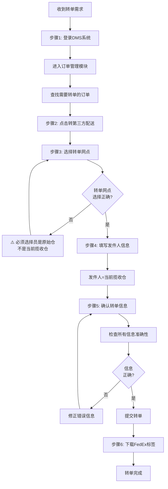

[← 返回首页](/WPGLP/) | [返回任务列表SOP](/WPGLP/WPLA13分拣仓调度-任务列表SOP/)

---

## 1. 概述

**仓库代码**: WPLA13  
**作业类型**: FedEx转单操作  
**适用岗位**: 仓库调度员  
**版本**: V1.0  
**生效日期**: 2025-09-28

## 2. FedEx转单操作

**作业时间**: 17:00-20:00（根据需要执行）  
**责任人**: 调度员  
**系统涉及**: DMS系统

### 2.1 操作流程图

### 2.2 详细操作步骤

#### 步骤1: 登录DMS系统
1. 访问DMS系统: https://dms.wpglb.com
2. 使用您的账号和密码登录
3. 进入 **订单管理** 模块

#### 步骤2: 查找并启动转单操作
1. 在订单管理页面搜索需要转单的订单号
2. 找到对应订单后，点击 **转第三方配送** 按钮
3. 系统将进入转单配置界面

#### 步骤3: 选择转单网点 ⚠️ *（关键步骤，容易出错！）*
1. 在转单网点下拉列表中选择目标网点
2. **重要提醒**：
   - ✅ **正确做法**：选择 **原始网点**（发过来的仓）
   - ❌ **错误做法**：选择当前揽收仓
   - 📍 转单网点是货物最终要转发到的配送网点
   - 📍 不要选择货物当前所在的揽收仓

#### 步骤4: 填写发件人信息
1. 在发件人栏位填写信息
2. **发件人** = 当前揽收仓信息
   - 仓库名称：WPLA13
   - 仓库地址：[填写完整仓库地址]
   - 联系电话：[仓库联系电话]
3. 确保发件人信息准确完整

#### 步骤5: 确认转单信息
在提交前，逐项检查以下信息：
- ✅ 订单号正确无误
- ✅ 转单网点 = 原始网点（发过来的仓）
- ✅ 发件人 = WPLA13揽收仓
- ✅ 收件人信息完整准确
- ✅ 转单原因已填写

#### 步骤6: 提交并下载标签
1. 确认所有信息无误后，点击 **提交** 按钮
2. 等待系统确认转单成功
3. **下载FedEx标签**
   - 点击下载按钮
   - 保存标签文件
   - 打印标签（如需要）
4. 将标签交给仓库贴标人员

### 2.3 转单注意事项

#### 关键区别说明
- **转单网点**：货物要转发到哪个网点（原始网点）
- **发件人**：货物从哪里发出（当前的WPLA13揽收仓）

#### 操作要求
- 📋 根据需求及时处理FedEx转单
- ✔️ 确认转单信息准确无误
- 🔄 及时更新系统状态
- 📝 详细记录转单原因和时间
- 📞 必要时通知目标网点接收货物
- 🏷️ 确保FedEx标签正确打印并贴附

## 3. 常见转单场景

### 3.1 客户要求转FedEx配送
**场景**: 客户不满意原配送方式，要求改用FedEx  
**处理**:
1. 确认客户需求
2. 在DMS中执行转单操作
3. 选择原始网点作为转单网点
4. 下载并打印FedEx标签
5. 通知仓库贴标

### 3.2 配送区域不覆盖
**场景**: 原配送方案无法到达目标区域  
**处理**:
1. 确认FedEx可覆盖该区域
2. 执行转单操作
3. 更新订单备注说明原因
4. 下载FedEx标签
5. 安排FedEx取件

### 3.3 时效要求变更
**场景**: 客户要求加急配送  
**处理**:
1. 评估FedEx时效优势
2. 与客户确认费用
3. 执行转单操作
4. 选择合适的FedEx服务类型
5. 下载标签并优先处理

## 4. 常见错误及避免方法

### 4.1 转单网点选择错误
**错误**: 选择了当前揽收仓而非原始网点  
**后果**: 订单无法正确路由，可能导致配送延误  
**避免**: 
- 仔细阅读下拉列表
- 选择"原始网点"或"发货仓"
- 不要选择WPLA13

### 4.2 发件人信息不完整
**错误**: 发件人地址或电话缺失  
**后果**: FedEx无法取件或联系  
**避免**:
- 使用标准的WPLA13信息模板
- 提交前逐项核对
- 保持信息更新

### 4.3 忘记下载FedEx标签
**错误**: 提交转单后未下载标签  
**后果**: 仓库无法贴标，货物无法发出  
**避免**:
- 提交后立即下载
- 确认下载成功
- 及时发送给仓库

### 4.4 未及时通知目标网点
**错误**: 转单后未通知接收方  
**后果**: 接收方准备不足，影响时效  
**避免**:
- 转单后立即通知
- 说明订单数量和预计到达时间
- 确认对方已知悉

## 5. 转单记录要求

### 5.1 必须记录的信息
- 订单号
- 转单时间
- 转单原因（客户要求/区域不覆盖/时效要求等）
- 原配送方式
- 新配送方式（FedEx服务类型）
- 转单网点
- FedEx标签编号
- 操作人员

### 5.2 记录位置
- DMS系统订单备注
- 每日工作日志
- 转单统计表（如有）

## 6. 关键控制点

### 6.1 准确性控制
- 转单网点必须选择正确
- 发件人信息必须完整
- 收件人信息必须核对

### 6.2 时效控制
- 收到转单需求后及时处理
- FedEx标签立即下载打印
- 当日转单当日完成

### 6.3 沟通控制
- 转单前与客户确认
- 转单后通知目标网点
- 异常情况及时上报

## 7. 相关链接

- [返回任务列表SOP](/WPGLP/WPLA13分拣仓调度-任务列表SOP/)
- [推单排程操作SOP](/WPGLP/WPLA13推单排程操作SOP/)
- [问题件处理SOP](/WPGLP/WPLA13问题件处理SOP/)

---

**编制**: Darrien, Michael From WPLA13  
**审核**: Tammy  
**版本**: V1.0  
**生效日期**: 2025-09-28

