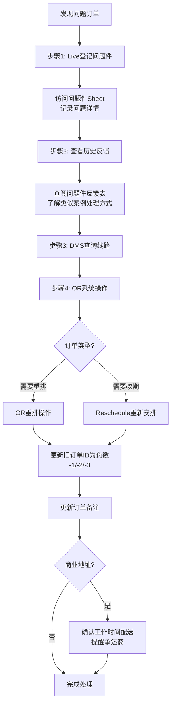
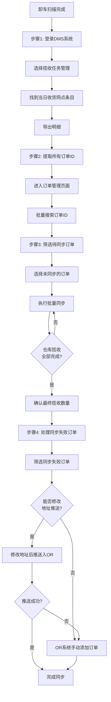
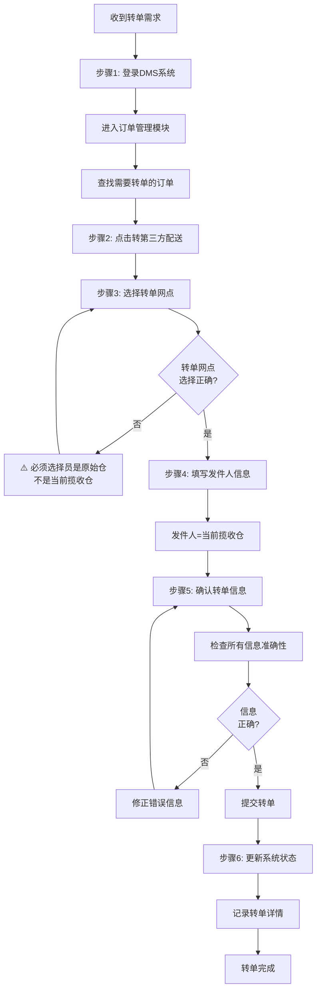

[← 返回首页](/WPGLP/) | [托盘回流管理SOP](/WPGLP/WPLA13托盘回流管理SOP/)

---

## 1. 概述

**仓库代码**: WPLA13  
**仓库类型**: 分拣仓  
**适用岗位**: 仓库调度员  
**版本**: V1.0  
**生效日期**: 2025-09-28

## 2. 日常工作流程概览

### 2.1 工作时序安排
**工作时间**: 13:00-21:00

- **上班前/早上**: 查看各客户微信群，确认当日揽收需求和货量
- **13:00-13:15**: 上班准备，安排揽收任务，通知司机，获取并分发揽收码
- **13:15-13:30**: 给前一天的订单进行reschedule
- **13:30-17:00**: 干线任务管理、问题件处理、POD查询、司机异常处理
- **17:00-20:00**: PDA卸车扫描，推单，排程，FedEx转单（如果需要）
- **21:00前**: 退货扫描要求、当日工作总结

## 3. 主要作业流程

### 3.1 上班准备阶段（13:00-13:15）

#### 3.1.1 提货任务安排
**作业时间**: 13:00-13:15  
**责任人**: 调度员  

**系统链接**:
- DMS系统: https://dms.wpglb.com/mainline/mainlineManage/listt

**操作步骤**:
1. **获取揽收码**
   - 登录DMS系统
   - 查看并打印当日揽收码

2. **揽收码交接**
   - 将电子版揽收码发送给仓库相关人员
   - 明确告知提货要求和注意事项
   - 确认仓库人员收到并理解提货任务

3. **提货跟进**
   - 跟踪提货进度
   - 确保提货按时完成
   - 记录提货完成情况

#### 3.1.2 揽收任务安排
**作业时间**: 13:00-13:15  
**责任人**: 调度员

**详细操作流程请参考**: [WPLA13揽收任务管理SOP](../WPLA13揽收任务管理SOP/)

**主要职责**:
- 通知司机去提货仓拉货回来（外部揽收）
- 确认当日揽收计划
- 发送提货清单给司机

#### 3.1.3 托盘回流管理
**作业时间**: 每日执行，按月统计  
**责任人**: 调度员

**详细操作流程请参考**: [WPLA13托盘回流管理SOP](../WPLA13托盘回流管理SOP/)

**主要职责**:
- 每日关注托盘回流需求
- 按月统计托盘累计数量
- 根据目标仓库需求安排托盘归还
- 维护托盘管理台账

---

### 3.2 订单Reschedule阶段（13:15-13:30）

#### 3.2.1 前一天订单Reschedule操作
**作业时间**: 13:15-13:30（固定时间段）  
**系统涉及**: OR系统、DMS系统  
**责任人**: 调度员

**重要说明**：
- ⚠️ **仅处理前一天的订单**
- ⚠️ **不要重派当天的订单**（当天问题件还未返回仓库）
- ✅ **例外情况**：如果订单还在派送网点（未返回仓库），可以立即reschedule
  - 常见情况：商业地址关门
  - 确认方式：联系司机或查看订单状态，确认包裹位置
  - 操作方式：直接在OR系统进行reschedule，安排第二天配送

**标准操作流程**:

1. **在OR系统中查找订单**
   - 登录OR系统
   - 选择对应的配送地区
   - 搜索订单号
   - 如果找到订单，直接进行reschedule操作

2. **DMS系统辅助查询（当OR中找不到订单时）**
   - 登录DMS系统: https://dms.wpglb.com
   - 使用你的账号密码登录
   - 在DMS中搜索订单号
   - 查看订单的**线路信息**字段
   - 记录该订单的**配送日期**

3. **返回OR系统进行Reschedule**
   - 返回OR系统
   - 进入"规划路线"页面
   - 选择从DMS查询到的**对应配送日期**
   - 输入订单号进行搜索
   - 找到订单后执行reschedule操作
   - **重要**：将旧的无效订单ID更新为-1（或-2、-3等）
     * OR系统不允许两个相同ID的订单同时存在
     * -1、-2、-3等负数ID代表历史派送记录
     * 这样可以保留历史记录同时允许创建新的派送任务

4. **Reschedule注意事项**
   - 根据干线发车时间表选择合适的配送日期
   - 考虑前几次派送失败的原因
   - 更新订单备注说明reschedule原因
   - 如果是商业地址，确保安排在工作时间内配送
---

### 3.3 问题件处理和日常监控阶段（13:30-17:00）

#### 3.3.1 问题件处理

**3.3.1.1 拦截单处理**
**检查项目**:
- 查拦截单
- 改地址处理
- 催派处理

**操作要求**:
- 联系李锐敏进行国内同步问题件处理
- 拦截退回需及时更新系统状态
- 维护每日异常记录

**3.3.1.2 地址和路线处理**

#### 操作流程图


#### 详细操作步骤

**步骤1: Live登记当日问题件** ⚠️ *（必须在OR reschedule之前完成）*
- 访问 [问题件登记表](https://docs.google.com/spreadsheets/d/1P_oFuZTluptr3Ck6Z64ZHvjPTA-sTHHkuA4GjXpp5WQ/edit?gid=725317117#gid=725317117)
- 详细记录问题内容：
  * 订单号
  * 问题类型（地址错误/客户拒收/无法联系等）
  * 当前状态
  * 计划处理方案

**步骤2: 查看历史问题件反馈**
- 访问 [问题件反馈查询表](https://doc.weixin.qq.com/sheet/e3_AQMA0QbeALkSGaMsyviM6RUG9a1nA?scode=AIAAhQcPAAk2b681EJAMwAZwY0AAc&tab=k06f50)
- 搜索类似问题的历史记录
- 参考之前的成功解决方案
- 避免重复相同的错误处理方式

**步骤3: DMS系统查询**
- 登录DMS系统查询订单线路信息
- 确认订单当前状态和配送历史
- 核对地址信息准确性

**步骤4: OR系统操作**
- **OR重排操作**：调整配送路线
- **Reschedule重新安排**：改期配送
- **更新旧订单ID状态**（设置为-1、-2、-3等负数）
  * 在OR系统中操作
  * 负数ID代表历史派送记录
  * 确保系统中不存在重复的有效ID
  * 保留历史记录便于追溯
- **更新订单备注**：
  * 说明reschedule原因
  * 记录特殊要求
  * 标注注意事项

**重要提醒**:
- ⚠️ **商业地址**必须在工作时间内配送完毕（通常9:00-17:00）
- 📞 及时通知承运商特殊配送要求
- 📝 所有操作必须在系统中留下记录


#### 3.3.3 司机异常处理

**3.3.3.1 司机状态监控**
**检查内容**:
- 司机在线情况
- 司机工作状态
- 是否需要重新排单

---

### 3.4 卸车和排单阶段（17:00-20:00）

#### 3.4.1 PDA卸车扫描
**作业时间**: 17:00-20:00  
**责任人**: 调度员  

**系统链接**:
- DMS系统: https://dms.wpglb.com/mainline/mainlineManage/listt
- 卸车扫描系统: https://pda.wpglb.com/unloadingScan

**操作步骤**:
1. **获取车牌号**
   - 登录DMS系统
   - 查看当日到达车辆信息
   - 记录车牌号（如HU65652等）

2. **执行卸车扫描**
   - 登录卸车扫描系统
   - 使用你的账号密码登录
   - 输入获取的车牌号
   - 开始卸车扫描操作

3. **卸车现场管理**
   - 协调卸车人员安排
   - 监督卸车进度和扫描准确性
   - 确保所有包裹完成扫描

4. **完成确认**
   - 记录卸车完成时间
   - 记录异常情况（如包裹破损、扫描异常等）
   - 在系统中确认卸车作业完成

#### 3.4.2 推单和排程操作

**操作时间**: 卸车扫描完成后立即开始  
**责任人**: 调度员

**3.4.2.1 DMS揽收任务管理和订单同步**

#### 操作流程图


#### 详细操作步骤

**步骤1: DMS系统登录和导出明细**
1. 登录DMS系统: https://dms.wpglb.com
2. 进入 **揽收任务管理** 模块
3. 筛选条件设置：
   - 选择当日日期
   - 选择对应的收货网点
4. 找到匹配的揽收任务条目
5. 点击 **导出明细** 按钮
6. 下载并打开导出的Excel文件

**步骤2: 提取订单ID并批量查询**
1. 从导出的明细表中提取所有订单ID
   - 复制ID列的全部数据
   - 建议使用Excel的复制功能一次性复制
2. 返回DMS系统
3. 进入 **订单管理** 页面
4. 使用 **搜索** 功能
   - 将复制的订单ID粘贴到搜索框
   - 点击批量查询

**步骤3: 订单同步操作** ⚠️ *（关键步骤）*
1. 在查询结果中筛选 **待同步** 状态的订单
2. 全选所有未同步的订单
3. 点击 **批量同步** 按钮
4. 等待系统处理完成
5. **循环检查和同步**：
   - 持续监控仓库揽收进度
   - 定期刷新订单列表
   - 重复同步操作，直到仓库全部揽收完成
6. **最终确认**：
   - 核对DMS中的揽收数量
   - 确认与实际卸货数量一致
   - 确保所有订单都已同步进系统

**步骤4: 处理同步失败订单**
1. 在订单管理页面选择 **同步失败** 状态筛选
2. 逐个检查失败原因（常见原因）：
   - 地址格式不正确
   - 地址信息不完整
   - 邮编格式错误
   - 收件人信息缺失
3. **方案A - 修改地址后推送**：
   - 点击编辑订单
   - 修正地址信息
   - 点击 **推送入OR** 按钮
   - 验证推送结果
4. **方案B - OR系统手动添加**（当修改后仍无法推送时）：
   - 登录OR系统
   - 选择对应的配送日期
   - 点击 **手动添加订单**
   - 手动录入订单信息：
     * 订单号
     * 收件人姓名
     * 收件地址
     * 联系电话
     * 包裹信息
   - 保存并分配到路线

**步骤5: 分配承运商和排程**
1. 确认派送路线和时间
2. 根据地区分配合适的承运商
3. 参考干线发车时间表进行排程（详见3.5节）
4. 优先处理时效要求高的订单

**3.4.2.2 排程注意事项**
- ✅ 确保所有订单100%同步成功后再进行排程
- ⏰ 根据干线发车时间表安排配送日期（详见3.5节）
- 🎯 考虑配送地区的服务时效要求
- ⚡ 优先处理时效要求高的订单
- 📊 记录同步失败订单的数量和原因，便于后续改进
- 🔄 定期与仓库确认揽收进度，避免遗漏

#### 3.4.3 FedEx转单（如果需要）

**作业时间**: 17:00-20:00（根据需要执行）  
**责任人**: 调度员  
**系统涉及**: DMS系统

#### 操作流程图


#### 详细操作步骤

**步骤1: 登录DMS系统**
1. 访问DMS系统: https://dms.wpglb.com
2. 使用您的账号和密码登录
3. 进入 **订单管理** 模块

**步骤2: 查找并启动转单操作**
1. 在订单管理页面搜索需要转单的订单号
2. 找到对应订单后，点击 **转第三返回配送** 按钮
3. 系统将进入转单配置界面

**步骤3: 选择转单网点** ⚠️ *（关键步骤，容易出错！）*
1. 在转单网点下拉列表中选择目标网点
2. **重要提醒**：
   - ✅ **正确做法**：选择 **原始网点**（发过来的仓）
   - ❌ **错误做法**：选择当前揽收仓
   - 📍 转单网点是货物最终要转发到的配送网点
   - 📍 不要选择货物当前所在的揽收仓

**步骤4: 填写发件人信息**
1. 在发件人栏位填写信息
2. **发件人** = 当前揽收仓信息
   - 仓库名称：WPLA13
   - 仓库地址：[填写完整仓库地址]
   - 联系电话：[仓库联系电话]
3. 确保发件人信息准确完整

**步骤5: 确认转单信息**
在提交前，逐项检查以下信息：
- ✅ 订单号正确无误
- ✅ 转单网点 = 员是网点（目标配送网点）
- ✅ 发件人 = WPLA13揽收仓
- ✅ 收件人信息完整准确
- ✅ 转单原因已填写

**步骤6: 提交并记录**
1. 确认所有信息无误后，点击 **提交** 按钮
2. 下载fedex标签

#### 转单注意事项

**关键区别说明**：
- **转单网点**：货物要转发哪个网点（原始网点）
- **发件人**：货物从哪里发出（当前的WPLA13揽收仓）


**操作要求**：
- 📋 根据需求及时处理FedEx转单
- ✔️ 确认转单信息准确无误
- 🔄 及时更新系统状态
- 📝 详细记录转单原因和时间
- 📞 必要时通知目标网点接收货物

---

### 3.5 干线发车时间表（排程参考）

<div style="background: #fff3cd; padding: 10px; margin: 10px 0; border-left: 4px solid #ffc107; border-radius: 3px;">
⚠️ <strong>重要提醒</strong>：排程日期 = 货物到达日期 = 派送日期，不是发车日期！
</div>

#### 3.5.1 SF和SAC干线
- **发车日期**: 周日到周三
- **停发日期**: 周四
- **发车日期**: 周五

#### 3.5.2 LAS和PHX干线（重点！）
**发车日期**: 周二、周四、周日

<div style="background: #e7f3ff; padding: 10px; margin: 10px 0; border-left: 4px solid #0969da; border-radius: 3px;">
💡 <strong>推送 vs 排单的区别</strong>：
<ul>
<li><strong>推送</strong>：每天都要做！把揽收的订单推送到OR系统</li>
<li><strong>排单</strong>：只在干线发车当天做！分配司机和路线</li>
</ul>
</div>

**LAS 4线排单规则**:

| 今天是 | 干线发车 | 何时排单 | 排哪几天 | 说明 |
|--------|----------|----------|----------|------|
| 周一 | 周二发车 | **不排单** | - | 订单推送到OR即可，等周二排 |
| 周二 | 今天发车 | **今天排** | 周三、周四 | ✅ 周二发车当天排，分两天排！ |
| 周三 | 周四发车 | **不排单** | - | ⚠️ 推送的订单改到周五，等周四排 |
| 周四 | 今天发车 | **今天排** | 周五、周六 | ✅ 周四发车当天排，分两天排！ |
| 周五 | 周日发车 | **不排单** | - | 订单推送到OR即可，等周日排 |
| 周六 | - | **不排单** | - | 休息日 |
| 周日 | 今天发车 | **今天排** | 周一、周二 | ✅ 周日发车当天排，分两天排！ |

**⚠️ 重要操作规则**：

**1. 周三特别注意（容易出错！）**：
- 周三推送到OR的订单，系统会**自动推到周四（待排程状态）**
- **这是错误的！** 必须手动改成周五
- **原因**：货周三发不出去，要等周四发车，周五才到达，所以只能周五派送
- **操作**：在OR系统中，把这些订单从周四移到周五

**2. 必须分两天排单（非常重要！）**：
- 例如：周二发车时，要**分开排周三的单**和**周四的单**
- **不能混在一起排！**
- **原因**：
  - ✅ 方便分拣仓贴标签后检查
  - ✅ 容易区分货物（周三的货和周四的货分开）
  - ✅ 避免配送日期错乱

**3. 司机不能连续两天使用**：
- 今天用过的司机，明天不能再用
- **原因**：方便分拣仓区分和检查货物
- **操作**：排周三单用司机A，排周四单用司机B

**排单步骤示例（周二发车）**：
```
步骤1：先排周三的单
- 进入OR系统
- 选择"周三"配送日期
- 分配司机A、B、C等

步骤2：再排周四的单
- 选择"周四"配送日期
- 分配司机D、E、F等（不能用A、B、C）
- 确保司机不重复
```

**PHX 6线排单规则**:
- 与LAS 4线完全相同
- 发车日期：周二、周四、周日
- 排单日：发车当天
- 必须分两天排，司机不能重复使用

#### 3.5.3 LA干线
- **发车频率**: 每天都要派送
- **排单规则**: 简单，当天卸货可以排第二天

#### 3.5.4 CBC干线
- **发车频率**: 每天发车
- **特殊说明**: 不需要我们排单，但需要我们备货

---

### 3.6 收尾工作（20:00-21:00）

#### 3.6.1 退货扫描
**处理要求**:
- 每日检查退货情况
- 及时处理退货订单
- 更新退货状态
- 21:00前完成所有退货扫描

#### 3.6.2 当日工作总结
**总结内容**:
- 记录当日卸车数量
- 记录异常件处理情况
- 记录reschedule订单数量
- 记录需要跟进的问题
- 准备第二天工作计划

---

## 4. 关键控制点

### 4.1 时间控制点
- 商业地址必须在21:00前完成配送安排
- 要求仓库扫描退货
- 严格按照干线发车时间表执行

### 4.2 质量控制点
- 每日异常记录维护
- 问题件及时同步和处理
- 系统状态及时更新

### 4.3 沟通协调点
- 及时联系李锐敏处理问题件
- 主动提醒承运商相关要求
- 等待包裹回到本地仓时联系对应人员登记到退货表

## 5. 异常处理

### 5.1 包裹丢失处理
1. 立即启动查找程序
2. 通过各系统进行追踪
3. 联系相关承运商
4. 记录处理过程和结果

### 5.2 派送失败处理
1. 分析失败原因
2. 确认包裹返回状态
3. 安排重新派送
4. 更新客户信息

## 6. 记录和报告

### 6.1 日常记录
- 每日异常记录
- 排单记录
- 问题件处理记录

### 6.2 定期报告
- 周报总结
- 月度分析报告
- 异常情况专项报告

## 7. 持续改进

### 7.1 流程优化
- 定期评估操作效率
- 收集操作人员反馈
- 持续改进作业流程

### 7.2 系统升级
- 关注系统更新
- 学习新功能应用
- 提出系统改进建议

---

**编制**: [姓名]  
**审核**: [姓名]  
**批准**: [姓名]  
**修订记录**: [版本变更记录]
