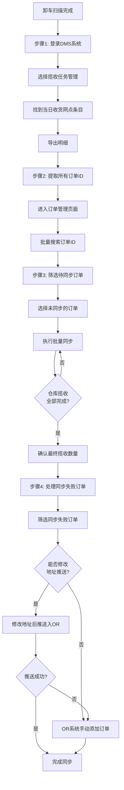

[← 返回首页](/WPGLP/) | [返回任务列表SOP](/WPGLP/WPLA13分拣仓调度-任务列表SOP/)

---

## 1. 概述

**仓库代码**: WPLA13  
**作业类型**: 推单和排程操作  
**适用岗位**: 仓库调度员  
**版本**: V1.0  
**生效日期**: 2025-09-28

## 2. DMS揽收任务管理和订单同步

**操作时间**: 卸车扫描完成后立即开始  
**责任人**: 调度员

### 2.1 操作流程图



### 2.2 详细操作步骤

#### 步骤1: DMS系统登录和导出明细
1. 登录DMS系统: https://dms.wpglb.com
2. 进入 **揽收任务管理** 模块
3. 筛选条件设置：
   - 选择当日日期
   - 选择对应的收货网点
4. 找到匹配的揽收任务条目
5. 点击 **导出明细** 按钮
6. 下载并打开导出的Excel文件

#### 步骤2: 提取订单ID并批量查询
1. 从导出的明细表中提取所有订单ID
   - 复制ID列的全部数据
   - 建议使用Excel的复制功能一次性复制
2. 返回DMS系统
3. 进入 **订单管理** 页面
4. 使用 **搜索** 功能
   - 将复制的订单ID粘贴到搜索框
   - 点击批量查询

#### 步骤3: 订单同步操作 ⚠️ *（关键步骤）*
1. 在查询结果中筛选 **待同步** 状态的订单
2. 全选所有未同步的订单
3. 点击 **批量同步** 按钮
4. 等待系统处理完成
5. **循环检查和同步**：
   - 持续监控仓库揽收进度
   - 定期刷新订单列表
   - 重复同步操作，直到仓库全部揽收完成
6. **最终确认**：
   - 核对DMS中的揽收数量
   - 确认与实际卸货数量一致
   - 确保所有订单都已同步进系统

#### 步骤4: 处理同步失败订单
1. 在订单管理页面选择 **同步失败** 状态筛选
2. 逐个检查失败原因（常见原因）：
   - 地址格式不正确
   - 地址信息不完整
   - 邮编格式错误
   - 收件人信息缺失
3. **方案A - 修改地址后推送**：
   - 点击编辑订单
   - 修正地址信息
   - 点击 **推送入OR** 按钮
   - 验证推送结果
4. **方案B - OR系统手动添加**（当修改后仍无法推送时）：
   - 登录OR系统
   - 选择对应的配送日期
   - 点击 **手动添加订单**
   - 手动录入订单信息：
     - 订单号
     - 收件人姓名
     - 收件地址
     - 联系电话
     - 包裹信息
   - 保存并分配到路线

#### 步骤5: 分配承运商和排程
1. 确认派送路线和时间
2. 根据地区分配合适的承运商
3. 参考干线发车时间表进行排程（详见第3节）
4. 优先处理时效要求高的订单

### 2.3 排程注意事项
- ✅ 确保所有订单100%同步成功后再进行排程
- ⏰ 根据干线发车时间表安排配送日期
- 🎯 考虑配送地区的服务时效要求
- ⚡ 优先处理时效要求高的订单
- 📊 记录同步失败订单的数量和原因，便于后续改进
- 🔄 定期与仓库确认揽收进度，避免遗漏

---

## 3. 干线发车时间表（排程参考）

<div style="background: #fff3cd; padding: 10px; margin: 10px 0; border-left: 4px solid #ffc107; border-radius: 3px;">
⚠️ <strong>重要提醒</strong>：排程日期 = 货物到达日期 = 派送日期，不是发车日期！
</div>

### 3.1 SF和SAC干线
- **发车日期**: 周日到周三
- **停发日期**: 周四
- **发车日期**: 周五

### 3.2 LAS和PHX干线（重点！）
**发车日期**: 周二、周四、周日

<div style="background: #e7f3ff; padding: 10px; margin: 10px 0; border-left: 4px solid #0969da; border-radius: 3px;">
💡 <strong>推送 vs 排单的区别</strong>：
<ul>
<li><strong>推送</strong>：每天都要做！把揽收的订单推送到OR系统</li>
<li><strong>排单</strong>：只在干线发车当天做！分配司机和路线</li>
</ul>
</div>

#### 3.2.1 LAS 4线排单规则

| 今天是 | 干线发车 | 何时排单 | 排哪几天 | 说明 |
|--------|----------|----------|----------|------|
| 周一 | 周二发车 | **不排单** | - | 订单推送到OR即可，等周二排 |
| 周二 | 今天发车 | **今天排** | 周三、周四 | ✅ 周二发车当天排，分两天排！ |
| 周三 | 周四发车 | **不排单** | - | ⚠️ 推送的订单改到周五，等周四排 |
| 周四 | 今天发车 | **今天排** | 周五、周六 | ✅ 周四发车当天排，分两天排！ |
| 周五 | 周日发车 | **不排单** | - | 订单推送到OR即可，等周日排 |
| 周六 | - | **不排单** | - | 休息日 |
| 周日 | 今天发车 | **今天排** | 周一、周二 | ✅ 周日发车当天排，分两天排！ |

#### 3.2.2 重要操作规则

**1. 周三特别注意（容易出错！）**：
- 周三推送到OR的订单，系统会**自动推到周四（待排程状态）**
- **这是错误的！** 必须手动改成周五
- **原因**：货周三发不出去，要等周四发车，周五才到达，所以只能周五派送
- **操作**：在OR系统中，把这些订单从周四移到周五

**2. 必须分两天排单（非常重要！）**：
- 例如：周二发车时，要**分开排周三的单**和**周四的单**
- **不能混在一起排！**
- **原因**：
  - ✅ 方便分拣仓贴标签后检查
  - ✅ 容易区分货物（周三的货和周四的货分开）
  - ✅ 避免配送日期错乱

**3. 司机不能连续两天使用**：
- 今天用过的司机，明天不能再用
- **原因**：方便分拣仓区分和检查货物
- **操作**：排周三单用司机A，排周四单用司机B

#### 3.2.3 排单步骤示例（周二发车）

```
步骤1：先排周三的单
- 进入OR系统
- 选择"周三"配送日期
- 分配司机A、B、C等

步骤2：再排周四的单
- 选择"周四"配送日期
- 分配司机D、E、F等（不能用A、B、C）
- 确保司机不重复
```

#### 3.2.4 PHX 6线排单规则
- 与LAS 4线完全相同
- 发车日期：周二、周四、周日
- 排单日：发车当天
- 必须分两天排，司机不能重复使用

### 3.3 LA干线
- **发车频率**: 每天都要派送
- **排单规则**: 简单，当天卸货可以排第二天

### 3.4 CBC干线
- **发车频率**: 每天发车
- **特殊说明**: 不需要我们排单，但需要我们备货

---

## 4. 常见问题处理

### 4.1 订单同步失败
**原因**: 地址格式错误、信息不完整  
**解决**: 修改地址后重新推送，或在OR系统手动添加

### 4.2 周三订单排程错误
**原因**: 系统自动推到周四  
**解决**: 手动改到周五，因为周三发不出货

### 4.3 司机重复使用
**原因**: 没有注意分两天排单  
**解决**: 检查司机分配，确保不同天使用不同司机

### 4.4 卸货数量与系统不符
**原因**: 扫描遗漏或多扫  
**解决**: 
- 核对实物与系统
- 重新扫描遗漏包裹
- 查找多扫描原因
- 更新系统记录

## 5. 关键控制点

### 5.1 质量控制
- 确保100%订单同步成功
- 核对卸货数量与系统数量一致
- 记录并分析同步失败原因

### 5.2 时效控制
- 卸车后立即开始推单
- 发车当天必须完成排单
- 优先处理时效订单

### 5.3 准确性控制
- 周三订单必须改到周五
- 分两天排单不能混淆
- 司机不能重复使用

## 6. 相关链接

- [返回任务列表SOP](/WPGLP/WPLA13分拣仓调度-任务列表SOP/)
- [FedEx转单操作SOP](/WPGLP/WPLA13-FedEx转单操作SOP/)
- [揽收任务管理SOP](/WPGLP/WPLA13揽收任务管理SOP/)

---

**编制**: Darrien, Michael From WPLA13  
**审核**: Tammy  
**版本**: V1.0  
**生效日期**: 2025-09-28

