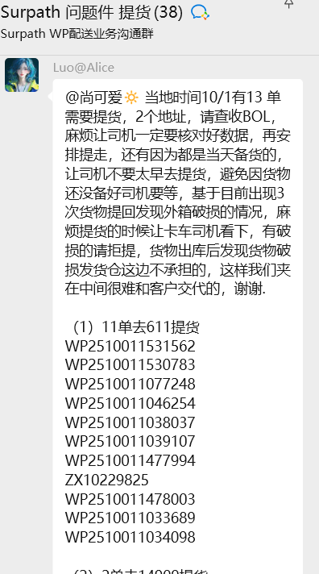
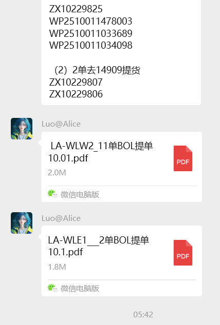

[← 返回首页](/WPGLP/) | [🔼 上级: 揽收任务管理SOP](/WPGLP/WPLA13揽收任务管理SOP/)

<div style="background: #fff3cd; padding: 10px; margin: 10px 0; border-left: 4px solid #ffc107; border-radius: 3px;">
ℹ️ <strong>说明</strong>: 本文档是"揽收任务管理SOP"的子任务文档，专门说明外部提货（让司机去提货仓拉货回来）的详细操作流程。
</div>

---

# 提货操作SOP标准流程

## 📋 目录
1. [什么是提货](#什么是提货)
2. [每日操作流程](#每日操作流程)
3. [如何确定今天的提货清单](#如何确定今天的提货清单)
4. [如何联系司机](#如何联系司机)
5. [提货注意事项](#提货注意事项)
6. [常见问题处理](#常见问题处理)

---

## 什么是提货

**提货** = 安排卡车去仓库提货

你的工作就是：
1. 确定今天哪些卡车需要出动
2. 确定每辆卡车要去哪些地址
3. 通知司机去提货
4. 跟进提货进度

---

## 每日操作流程

### ⏰ 时间线

```
上午 8:00-9:00  → 步骤1-3：查看通知，制作提货清单
上午 9:00-10:00 → 步骤4：联系司机安排提货
全天跟进      → 步骤5：确认提货完成
下午          → 步骤6：记录和总结
```

---

### 📝 步骤1：确认今天是星期几

**为什么重要？**
不同的星期几，提货的地方不一样。

| 今天 | 需要注意 |
|------|----------|
| 周日 | 只有53尺和30尺的部分地点工作 |
| 周一 | 所有车工作，30尺要去九方仓库，**53尺必去DWLAX** |
| 周二 | 所有车工作（53尺看DWLAX货量决定是否去） |
| 周三 | 所有车工作，30尺要去九方仓库 |
| 周四 | 所有车工作 |
| 周五 | 所有车工作，30尺要去九方仓库 |
| 周六 | 所有车休息，不提货 ❌ |

---

### 📱 步骤2：查看客户群通知

**必须查看的群：**

✅ **Surpath相关群**
- 看今天有没有发提货通知
- 通知会告诉你：
  - 哪个地址需要提货
  - 有多少单
  - 单号是什么
  - 有什么特殊要求

**Surpath通知示例：**
```
当地时间10/1有13单需要提货，2个地址：
（1）11单去611提货
（2）2单去14909提货
```

**实际通知截图：**

<div style="margin: 15px 0;">


*图1：Surpath群通知 - 显示611地址11单的详细单号*


*图2：Surpath群通知 - 显示14909地址2单及PDF附件（BOL提单）*

</div>

<div style="background: #e7f3ff; padding: 10px; margin: 10px 0; border-left: 4px solid #0969da; border-radius: 3px;">
💡 <strong>注意事项</strong>：
<ul>
<li>通知会包含详细的单号列表</li>
<li>会有BOL提单PDF附件供核对</li>
<li>务必检查单号和数量是否匹配</li>
<li>提醒司机核对BOL，检查外箱破损</li>
</ul>
</div>

✅ **其他客户群**
- 看有没有临时的提货需求
- 看有没有地址变更通知
- 看有没有取消提货的通知

---

### 📋 步骤3：制作今天的提货清单

#### 3.1 列出固定地点

根据今天是星期几，先列出固定要去的地方。

**工具：使用下面的快速查询表**

#### 3.2 添加临时通知的地点

把客户群里通知的地址加到清单里。

#### 3.3 按车型分组

把所有地址按53尺、30尺、26尺分成三组。

**今天提货清单模板：**

```
📅 日期：    年  月  日 星期

🚛 53尺卡车
门牌号：
总共：  个地址

🚐 30尺卡车
门牌号：
总共：  个地址

🚙 26尺卡车
门牌号：
总共：  个地址

⚠️ 特殊提醒：
□ Surpath有  单需要提货
□ 注意检查外箱破损
□ 其他：
```

---

### 📞 步骤4：联系司机安排提货

#### 4.1 准备信息

给司机发信息前，准备好：
- ✅ 所有地址的门牌号
- ✅ 所有地址的完整地址
- ✅ 单号（如果有）
- ✅ 特殊要求（如果有）

#### 4.2 联系方式

| 车型 | 联系人 | 电话 | 角色 |
|------|--------|------|------|
| 53尺 | Ason | 626-757-1752 | 老板 |
| 53尺 | 罗师傅 | 917-288-2219 | 司机 |
| 53尺 | 孙师傅 | 626-653-5666 | 司机 |
| 30尺 | 王师傅 | 626-889-0639 | 司机（WP提货群）|
| 30尺 | 刘 | 949-533-7222 | 老板 |
| 26尺 | Alex | 626-734-0817 | 司机 |
| 26尺 | Edward (肖老板) | 840-208-5398 | 老板 |

#### 4.3 发送提货信息模板

<details>
<summary><strong>📱 点击展开：司机提货通知模板（可复制粘贴）</strong></summary>

<div style="background: #f8f9fa; border: 2px solid #0969da; border-radius: 8px; padding: 20px; margin: 15px 0;">

**标准模板：**

```
[日期] [车型]提货安排

今天需要提货的地址：
1. [代码] - [门牌号] [完整地址]
2. [代码] - [门牌号] [完整地址]
...

⚠️ 重要提醒：
• 请核对单号和数量
• 检查外箱是否有破损
• 有破损请拒绝提货
• [其他特殊要求]

总共：X个地址
请确认收到，谢谢！
```

**实际示例：**

```
10/1 26尺提货安排

今天需要提货的地址：
1. DWLAX - 5553 Bandini Blvd STE A Bell CA
2. LAWLW2 - 611 Reyes Dr, Walnut, CA 91789（11单）

⚠️ 重要提醒：
• 611有11单，单号见附件
• 请核对单号和数量
• 检查外箱是否有破损，有破损请拒提
• 不要太早去，避免货物还没备好

总共：2个地址
请确认收到，谢谢！
```

**正常提货通知：**

```
[司机姓名]，你好！

今天[日期]需要提货，地址如下：
1. [门牌号] - [完整地址]
2. [门牌号] - [完整地址]

建议提货时间：[时间]
特殊要求：无

请确认收到，谢谢！
```

**有特殊要求的通知：**

```
[司机姓名]，你好！

今天[日期]需要提货，地址如下：
1. [门牌号] - [完整地址] ([X]单)
   单号：[列出所有单号]

⚠️ 重要提醒：
• 请务必核对单号和数量
• 检查外箱是否有破损
• 发现破损请拒绝提货
• 不要太早去，避免货物未备好

建议提货时间：[时间]
请确认收到，谢谢！
```

**紧急加单通知：**

```
[司机姓名]，临时加单！

今天需要加去：
[门牌号] - [完整地址]

原因：[说明原因]
请确认是否可以，谢谢！
```

</div>

</details>

---

### ✅ 步骤5：跟进提货进度

#### 5.1 制作跟进表

| 地址 | 门牌号 | 单数 | 司机确认时间 | 到达时间 | 提货完成时间 | 状态 | 备注 |
|------|--------|------|--------------|----------|--------------|------|------|
| DWLAX | 5553 | - | 9:15 | 10:30 | 11:00 | ✅完成 | 正常 |
| LAWLW2 | 611 | 11 | 9:15 | 11:30 | 12:15 | ✅完成 | 正常 |

#### 5.2 主动询问进度

如果司机长时间没反馈：
- **出发后1小时**：询问是否到达
- **到达后1小时**：询问提货情况
- **遇到问题**：及时沟通解决

---

### 📊 步骤6：记录和总结

#### 6.1 每日记录

完成后记录：
```
日期：____年____月____日 星期____
53尺：提货__个地址 ✅完成 / ⚠️问题：____
30尺：提货__个地址 ✅完成 / ⚠️问题：____
26尺：提货__个地址 ✅完成 / ⚠️问题：____
特殊情况：____
```

#### 6.2 问题记录

如果遇到问题，详细记录：
- 什么问题？
- 哪个地址？
- 怎么解决的？
- 下次如何避免？

---

## 如何确定今天的提货清单

### 📅 周一到周五（工作日）

#### 53尺固定去的地方
**每天必去：**
```
7820 (USLAX17)
2000 (USLAX08)
1979 (WPLA16)
13277 (WPLA15)
13083 (WPLA4)
7776 (WPLA11)
```

**看情况去（一般周一、周二）：**
```
5553 (DWLAX) - 周一必去（因为周末不提货，货量多）
              周二货量大时也需要去
```

---

#### 30尺固定去的地方

**每天必去：**
```
9059 (WPLA)
4600 (WPLA3)
11281 (COCA)
11618 (FNT1)
5450 (ONT1)
13423 (WPLA17)
4773 (YLCA01) - 看货量
```

**周一、三、五加上：**
```
15850 (USLAX05)
1910 (USLAX07)
```

**看群通知：**
```
14909 (LAWLE1) - 如果Surpath群有通知就去
```

---

#### 26尺固定去的地方

**每天必去：**
```
5553 (DWLAX)
```

**看群通知：**
```
611 (LAWLW2) - 如果Surpath群有通知就去
1751 (LAKST) - 如果Surpath群有通知就去
```

<div style="background: #fff3cd; padding: 10px; margin: 10px 0; border-left: 4px solid #ffc107; border-radius: 3px;">
📌 <strong>重要备注</strong>: 下周26尺多加一辆车的时候，需要重新平均分配WP提货群（30尺）和26尺的提货任务。
</div>

---

### 📅 周日

#### 53尺
```
1979 (WPLA16)
13277 (WPLA15)
13083 (WPLA4)
7776 (WPLA11)
```

#### 30尺
```
9059 (WPLA)
4600 (WPLA3)
11281 (COCA)
11618 (FNT1)
5450 (ONT1)
13423 (WPLA17)
```

#### 26尺
```
不工作 ❌
```

---

### 📅 周六
```
所有车都不工作 ❌
```

---

## 如何联系司机

### 📞 联系前检查清单

在联系司机前，确保你有：

- [ ] 完整的地址列表
- [ ] 所有门牌号
- [ ] 单号（如果有）
- [ ] 特殊要求（如果有）
- [ ] 预计提货时间建议

### 💬 沟通技巧

**✅ 好的沟通方式：**
```
信息清晰、完整
有具体的地址和门牌号
有特殊提醒
有礼貌，说"谢谢"
```

**❌ 不好的沟通方式：**
```
信息不完整
只给代码，不给地址
没有特殊提醒
态度不好
```

---

## 提货注意事项

### ⚠️ 提货前

#### 1. 时间安排
- ✅ 不要太早去（特别是当天备货的）
- ✅ 避开交通高峰期
- ✅ 给司机足够的时间

#### 2. 信息确认
- ✅ 地址是否正确
- ✅ 门牌号是否正确
- ✅ 联系人是否有变化

#### 3. 特殊要求
- ✅ 是否需要预约
- ✅ 是否有装卸时间限制
- ✅ 是否需要特殊设备

---

### 📦 提货时

#### 司机必须做的事情：

**1. 核对数据**
```
✅ 核对单号
✅ 核对数量
✅ 核对目的地
```

**2. 检查货物**
```
✅ 检查外箱是否完好
✅ 检查是否有破损
✅ 检查是否有受潮
✅ 检查标签是否清晰
```

**3. 拒提条件**
```
❌ 外箱有明显破损
❌ 货物有明显受损
❌ 数量不符
❌ 单号不符
```

**重要！** 
如果司机提走了破损的货物，出库后发现问题：
- 发货仓不承担责任
- 我们要对客户负责
- 会很难处理

所以一定要在提货时就检查好！

---

### 📝 提货后

#### 1. 获取提货凭证
- ✅ BOL（提货单）
- ✅ 照片（如有需要）
- ✅ 签字确认

#### 2. 更新系统
- ✅ 记录提货时间
- ✅ 记录实际数量
- ✅ 更新状态

#### 3. 通知相关人员
- ✅ 通知调度已完成
- ✅ 如有问题及时上报

---

## 常见问题处理

### ❓ 问题1：司机说找不到地址

**解决方法：**
1. 提供完整地址（包括城市、州、邮编）
2. 提供代码（如DWLAX）
3. 提供联系人电话
4. 让司机用Google Maps导航
5. 如果还是找不到，联系仓库确认地址

---

### ❓ 问题2：司机到了但货还没准备好

**解决方法：**
1. 让司机稍等15-30分钟
2. 联系仓库询问还需要多久
3. 如果需要等很久，安排司机先去其他地址
4. 下次提前和仓库确认好时间

**预防方法：**
- 不要太早安排提货
- 当天备货的尽量下午去
- 提前和仓库沟通好时间

---

### ❓ 问题3：发现货物有破损

**解决方法：**
1. 立即拍照记录
2. 通知仓库负责人
3. 确认是否可以更换
4. 如果不能更换，拒绝提货
5. 上报情况

**重要：**
绝对不要提走破损的货物！
出库后发现破损，仓库不负责。

---

### ❓ 问题4：单号或数量对不上

**解决方法：**
1. 和仓库核对单号
2. 和仓库核对数量
3. 确认是否有遗漏
4. 如果确实对不上，不要提货
5. 联系客户确认

---

### ❓ 问题5：临时收到加单通知

**解决方法：**
1. 确认是哪个地址
2. 确认有多少单
3. 检查司机是否还有时间
4. 如果可以，安排加单
5. 如果不行，安排其他司机或改天

---

### ❓ 问题6：司机说车装不下

**解决方法：**
1. 确认实际货量
2. 评估是否真的装不下
3. 如果确实装不下：
   - 分两次提货
   - 或安排另一辆车
4. 下次提前评估货量，安排合适的车型

---

### ❓ 问题7：Surpath群没有通知，要不要去？

**解决方法：**
- 没有通知 = 不去
- 这些地址是"看群通知"，不是固定的
- 只有群里发了通知才去

**相关地址：**
- 611 (LAWLW2)
- 1751 (LAKST)
- 14909 (LAWLE1)
- YLLA

---

### ❓ 问题8：周一、三、五九方仓库要去吗？

**解决方法：**
- 必须去！
- 15850 (USLAX05)
- 1910 (USLAX07)
- 这是固定安排

---

### ❓ 问题9：18450要不要去提货？

**解决方法：**
- 不去！
- 18450 (WPLA13) 是终点仓
- 其他地方的货会送到这里
- 不从这里提货

---

### ❓ 问题10：司机没有按时反馈怎么办？

**解决方法：**
1. 主动联系询问
2. 确认是否遇到问题
3. 如果没接电话，发短信/微信
4. 如果还是联系不上，联系备用司机
5. 必要时向上级汇报

---

## 📊 每日检查清单

**出发前检查：**
- [ ] 确认今天是星期几
- [ ] 查看所有客户群通知
- [ ] 制作完整的提货清单
- [ ] 按车型分好组
- [ ] 准备好所有地址信息
- [ ] 联系所有司机
- [ ] 司机都确认收到信息

**提货中检查：**
- [ ] 跟进每个地址的进度
- [ ] 及时处理问题
- [ ] 记录特殊情况

**完成后检查：**
- [ ] 所有地址都提货完成
- [ ] 获取所有提货凭证
- [ ] 更新系统状态
- [ ] 完成每日记录
- [ ] 总结问题和经验

---

## 📞 紧急联系方式

| 车型 | 姓名 | 电话 | 角色 |
|------|------|------|------|
| 53尺 | Ason | 626-757-1752 | 老板 |
| 53尺 | 罗师傅 | 917-288-2219 | 司机 |
| 53尺 | 孙师傅 | 626-653-5666 | 司机 |
| 30尺 | 王师傅 | 626-889-0639 | 司机（WP提货群）|
| 30尺 | 刘 | 949-533-7222 | 老板 |
| 26尺 | Alex | 626-734-0817 | 司机 |
| 26尺 | Edward (肖老板) | 840-208-5398 | 老板 |

---

## 💡 成功的提货员是什么样的？

✅ **细心**
- 不漏掉任何一个地址
- 不搞错单号和数量
- 提前发现潜在问题

✅ **主动**
- 主动查看群通知
- 主动跟进进度
- 主动沟通问题

✅ **负责**
- 确保每个地址都提货
- 确保货物没有问题
- 确保司机理解要求

✅ **沟通好**
- 和司机沟通清晰
- 和仓库沟通及时
- 和团队配合默契

✅ **有条理**
- 清单清晰
- 记录完整
- 流程规范

---

## 📚 附录：快速参考

### 车型识别

| 群名包含 | 车型 |
|----------|------|
| "Flatiron 53尺 - YongAn" | 53尺 |
| "YONGAN"（只写这个） | 30尺 |
| "WP提货群" | 30尺 |
| "Westnovo" 或 "Alex" | 26尺 |

### 地址分类速查

**53尺固定地址：**
7820, 2000, 1979, 13277, 13083, 7776

**30尺固定地址：**
9059, 4600, 11281, 11618, 5450, 13423, 4773

**30尺周一三五加：**
15850, 1910

**26尺固定地址：**
5553

**看群通知才去：**
611, 1751, 14909, YLLA

**不要去：**
18450（终点仓）

---

**编制**: Darrien，Michael From WPLA13  
**审核**: Tammy  
**批准**: [姓名]  
**修订记录**: V1

---

**记住：如果有任何不确定的，一定要问！**  
**不要猜测，不要假设，问清楚再做！**

