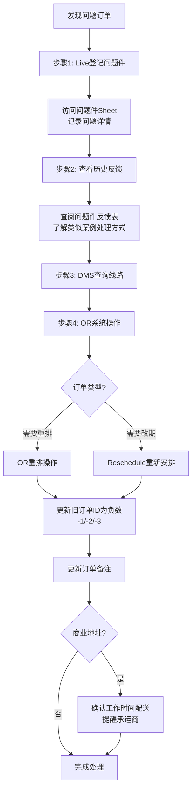

[← 返回首页](/WPGLP/) | [返回任务列表SOP](/WPGLP/WPLA13分拣仓调度-任务列表SOP/)

---

## 1. 概述

**仓库代码**: WPLA13  
**作业类型**: 问题件处理  
**适用岗位**: 仓库调度员  
**版本**: V1.0  
**生效日期**: 2025-09-28

## 2. 问题件处理流程

**作业时间**: 13:30-17:00  
**责任人**: 调度员

### 2.1 拦截单处理

#### 检查项目
- 查拦截单
- 改地址处理
- 催派处理

#### 操作要求
- 联系李锐敏进行国内同步问题件处理
- 拦截退回需及时更新系统状态
- 维护每日异常记录

### 2.2 地址和路线处理

#### 操作流程图

#### 详细操作步骤

**步骤1: Live登记当日问题件** ⚠️ *（必须在OR reschedule之前完成）*
- 访问 [问题件登记表](https://docs.google.com/spreadsheets/d/1P_oFuZTluptr3Ck6Z64ZHvjPTA-sTHHkuA4GjXpp5WQ/edit?gid=725317117#gid=725317117)
- 详细记录问题内容：
  - 订单号
  - 问题类型（地址错误/客户拒收/无法联系等）
  - 当前状态
  - 计划处理方案

**步骤2: 查看历史问题件反馈**
- 访问 [问题件反馈查询表](https://doc.weixin.qq.com/sheet/e3_AQMA0QbeALkSGaMsyviM6RUG9a1nA?scode=AIAAhQcPAAk2b681EJAMwAZwY0AAc&tab=k06f50)
- 搜索类似问题的历史记录
- 参考之前的成功解决方案
- 避免重复相同的错误处理方式

**步骤3: DMS系统查询**
- 登录DMS系统查询订单线路信息
- 确认订单当前状态和配送历史
- 核对地址信息准确性

**步骤4: OR系统操作**
- **OR重排操作**：调整配送路线
- **Reschedule重新安排**：改期配送
- **更新旧订单ID状态**（设置为-1、-2、-3等负数）
  - 在OR系统中操作
  - 负数ID代表历史派送记录
  - 确保系统中不存在重复的有效ID
  - 保留历史记录便于追溯
- **更新订单备注**：
  - 说明reschedule原因
  - 记录特殊要求
  - 标注注意事项

### 2.3 司机异常处理

#### 司机状态监控
**检查内容**:
- 司机在线情况
- 司机工作状态
- 是否需要重新排单

#### DMS系统操作
**操作要求**:
- 查询上一个工作日情况
- 处理相关排单需求

## 3. 重要提醒

- ⚠️ **商业地址**必须在工作时间内配送完毕（通常9:00-17:00）
- 📞 及时通知承运商特殊配送要求
- 📝 所有操作必须在系统中留下记录
- 🔄 必须先在问题件登记表中记录，再进行OR操作

## 4. 常见问题类型及处理方法

### 4.1 地址错误
**处理步骤**:
1. 联系客户确认正确地址
2. 在DMS系统中更新地址
3. 在OR系统中重新排单
4. 通知承运商地址变更
5. 在问题件表中记录处理结果

### 4.2 客户拒收
**处理步骤**:
1. 了解拒收原因
2. 联系李锐敏同步国内处理
3. 根据指示安排退货或重新派送
4. 更新系统状态
5. 记录拒收原因和处理方案

### 4.3 无法联系客户
**处理步骤**:
1. 尝试多种联系方式（电话、邮件）
2. 查看历史配送记录
3. 考虑留置通知
4. 根据公司政策处理超期订单
5. 记录联系尝试和结果

### 4.4 商业地址关门
**处理步骤**:
1. 确认客户营业时间
2. 立即reschedule到下一个工作日
3. 安排在营业时间内配送
4. 在订单备注中标注营业时间
5. 提醒承运商注意配送时间

## 5. 异常处理记录要求

### 5.1 必须记录的信息
- 订单号
- 问题发现时间
- 问题类型和详细描述
- 处理措施
- 处理结果
- 责任人

### 5.2 记录平台
- [问题件登记表](https://docs.google.com/spreadsheets/d/1P_oFuZTluptr3Ck6Z64ZHvjPTA-sTHHkuA4GjXpp5WQ/edit?gid=725317117#gid=725317117) - 当日问题件
- [问题件反馈查询表](https://doc.weixin.qq.com/sheet/e3_AQMA0QbeALkSGaMsyviM6RUG9a1nA?scode=AIAAhQcPAAk2b681EJAMwAZwY0AAc&tab=k06f50) - 历史记录查询
- DMS系统 - 订单状态更新
- OR系统 - 派送任务调整

## 6. 关键控制点

### 6.1 时间控制
- 问题件必须在发现当日处理
- 商业地址问题必须立即处理
- 紧急问题件优先处理

### 6.2 质量控制
- 所有问题件必须先登记再操作
- 必须查询历史反馈记录
- 处理结果必须记录完整

### 6.3 沟通协调
- 及时联系李锐敏处理国内同步问题
- 主动通知承运商特殊要求
- 必要时直接联系客户确认信息

## 7. 相关链接

- [返回任务列表SOP](/WPGLP/WPLA13分拣仓调度-任务列表SOP/)
- [订单Reschedule操作SOP](/WPGLP/WPLA13订单Reschedule操作SOP/)
- [问题件登记表](https://docs.google.com/spreadsheets/d/1P_oFuZTluptr3Ck6Z64ZHvjPTA-sTHHkuA4GjXpp5WQ/edit?gid=725317117#gid=725317117)
- [问题件反馈查询表](https://doc.weixin.qq.com/sheet/e3_AQMA0QbeALkSGaMsyviM6RUG9a1nA?scode=AIAAhQcPAAk2b681EJAMwAZwY0AAc&tab=k06f50)

---

**编制**: Darrien, Michael From WPLA13  
**审核**: Tammy  
**版本**: V1.0  
**生效日期**: 2025-09-28

